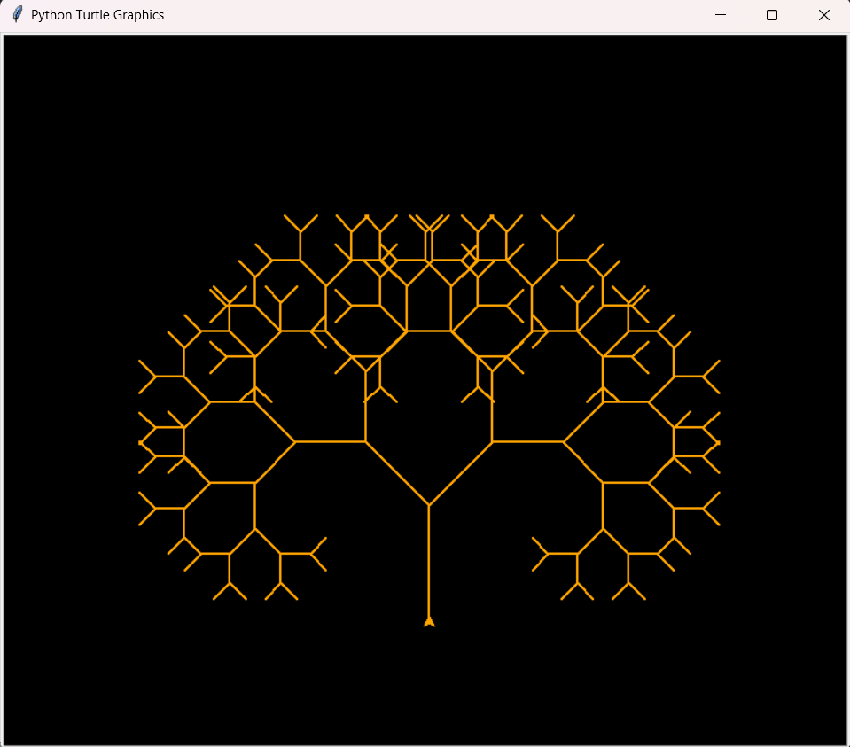
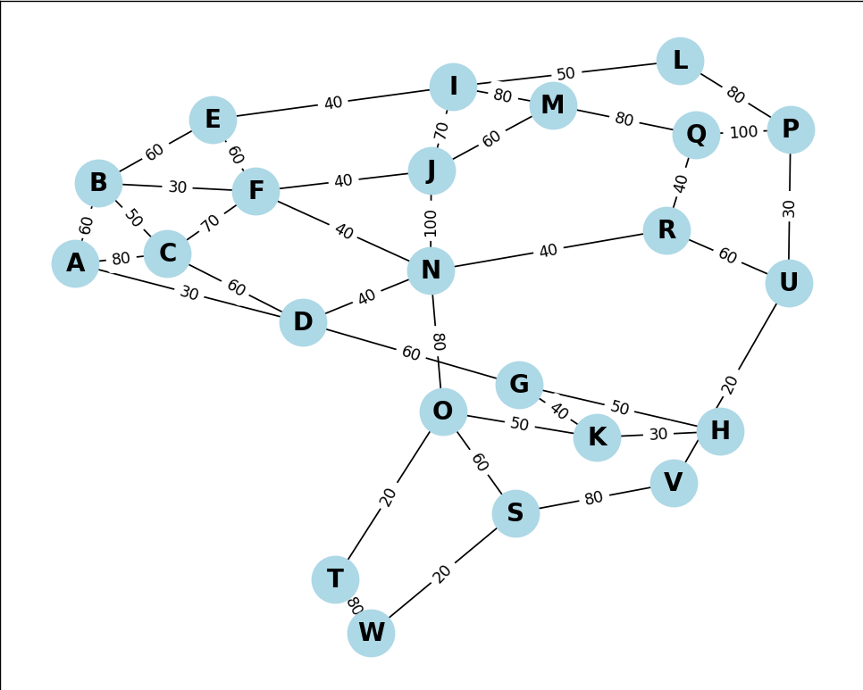
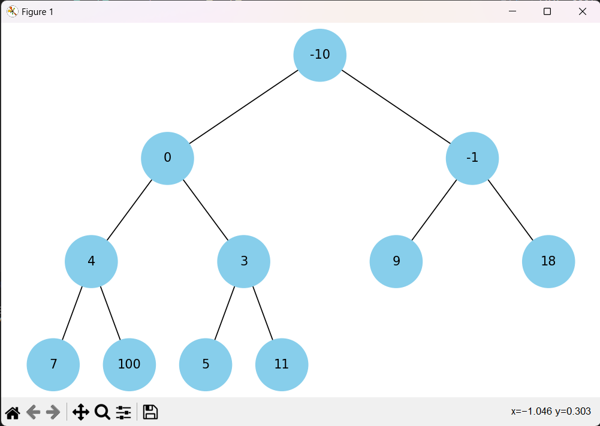
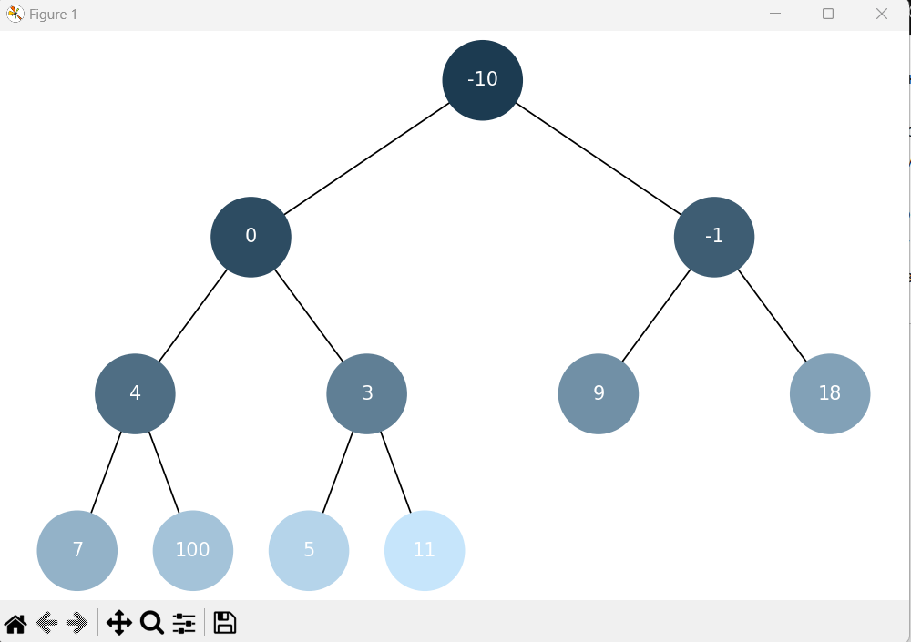
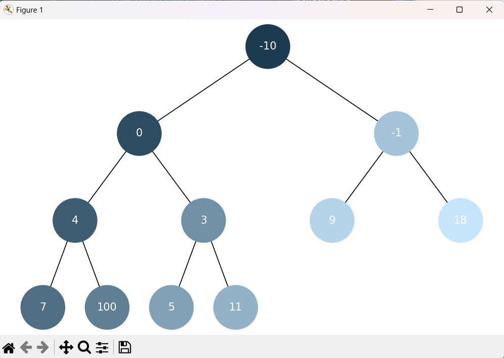
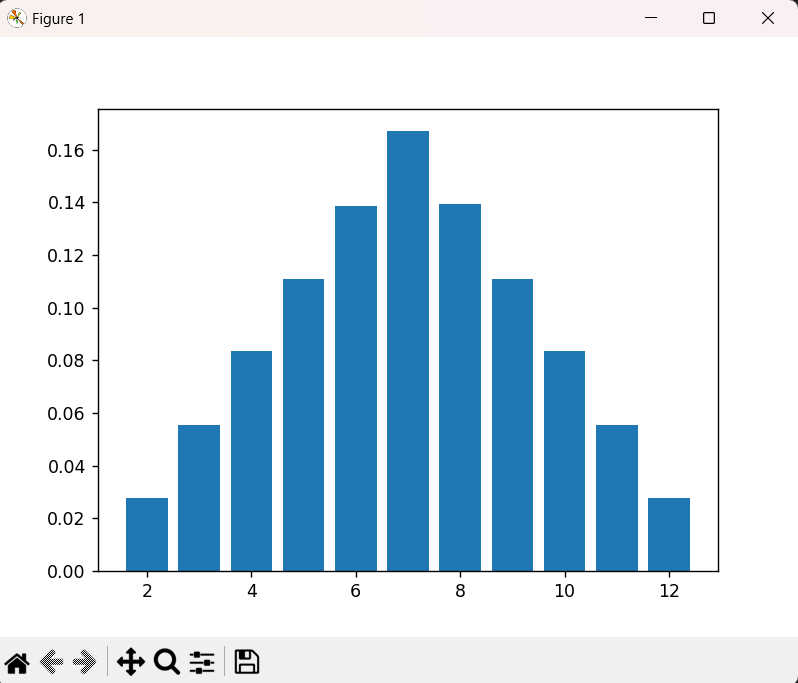
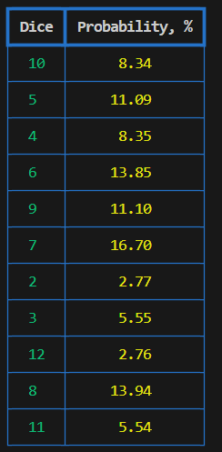

# Висновки:

## Task1

в даному завданні було реалізовано однозв'язний список та додано наступний функціонал:

- вставка спочатку списку (` insert_at_beginning `)

- вставка в кінець списку (` insert_at_end `)

- вставка в після вузла (` insert_after `)

- вставка в перед вузлом (` insert_before `)

- видалення вузла (` delete_node `)

- пошук вузла (` search_element `)

- реверсування списку (` reverse_list `)

- сортування злиттям (` MergeSort `)

Також було реалізовано можливість об'єднує два відсортовані однозв'язні списки в один відсортований список (функція ` merge_lists `)

Для дослідження роботи однозв'язного списку було реалізовано створення двух списків з додаванням елементів використовуючи вище наведений функціонал. Після створення списки було відсортовано сортуванням злиттям. На другому списку продемонстрована робота реверсування.

 Результати роботи даних функцій їаступні:

 ```
Однозв'язний список 1:
15 10 5 20 8 25 7
Відсортований однозв'язний список 1:
5 7 8 10 15 20 25
Однозв'язний список 2:
115 -10 35 -20 55
Реверс одозв'язного списку 2:
55 -20 35 -10 115
Відсортований однозв'язний список 2:
-20 -10 35 55 115
Злиття двох відсортованих однозвязних списків:
-20 -10 5 7 8 10 15 20 25 35 55 115
 ```

## Task2

виконано рекурсивну побудову дерева Піфагора з можливістю задавання глибини рекурсії.

Результати роботи алгоритму наведено на рисунку 1 з глибиною рекурсії 8.



*Рисунок 1 - Дерево Піфагора з глибиною рекурсї 8*

## Task3

використовуючи бінарну купу розроблено алгоритм Дейкстри для знаходження найкоротших шляхів у зваженому графі.

Було проведено  дослідження роботи алгоритму та його результат порівняно з бібліотечним методом ` networkx ` ` single_source_dijkstra_path_length `. Знайдено найкоротші шляхи між всіма заданими точками. Також було побудовано граф з вагами ребер (рисунок 2) 



*Рисунок 2 - Граф з вагами ребер*

Результат дослідження та перевірки наведено нижче

```
Перевірка правильності розрахунку розробленого та бібліотечного алгоритмів Дейкстри

Розроблений алгоритм Дейкстри:
[('A', 0), ('B', 50), ('C', 60), ('D', 60), ('F', 70), ('E', 80),
 ('I', 120), ('G', 130), ('J', 130), ('N', 130), ('H', 140), 
 ('L', 140), ('O', 140), ('K', 150), ('M', 150), ('P', 160), 
 ('E', 80), ('I', 120), ('G', 130), ('J', 130), ('N', 130), 
 ('H', 140), ('L', 140), ('O', 140), ('K', 150), ('M', 150), 
 ('P', 160), ('Q', 200), ('R', 210), ('S', 210), ('U', 220), 
 ('V', 220), ('T', 240), ('W', 290)]   
Бібліотечний алгоритм Дейкстри:
{'A': 0, 'B': 50, 'C': 60, 'D': 60, 'F': 70, 'E': 80, 'I': 120, 
'N': 130, 'G': 130, 'J': 130, 'L': 140, 'O': 140, 'H': 140, 
'M': 150, 'K': 150, 'P': 160, 'Q': 200, 'S': 210, 'R': 210, 
'U': 220, 'V': 220, 'T': 240, 'W': 290}
```
## Task4

реалізовано побудову бінарної купи, а також її візуалізацію (рисунок 3).



*Рисунок 3 - Візуалізація бінарної купи*

## Task5

виконано візуалізацію обходу бінарної купи алгоритмом пошуку в ширину (рисунок 4) та в глибину (рисунок 5)



*Рисунок 4 - Обхід бінарної купи пошуком в ширину*



*Рисунок 5 - Обхід бінарної купи пошуком в глубину*

## Task6

розроблено функції ` greedy_algorith ` жадібного алгоритму та ` dynamic_programming ` алгоритму динамічного програмування для обчислення оптимального набору страв для максимізаціїї калорій при обмеженому бюджеті.

Нижче наведено результати дослідження роботи даних функцій

```
Greedy algorithm:
selected_items =  ['cola', 'potato', 'pepsi', 'hot-dog']
total_calories =  870
total_cost =  80

Dynamic programming:
selected_items =  ['potato', 'cola', 'pepsi', 'pizza']
total_calories =  970
total_cost =  100
```

Як видно з результатів, в цій задачі видно основний недолік жадібних алгоритмів - вибір локальних оптимумів.
Натомість алгоритм динамічного програмування використовує повністю наявний бюджет з більшим профітом калорійності.

## Task7

написано програму, яка імітує велику кількість кидків кубиків (двох), обчислено суму їх чисел та визначено ймовірність кожної можливої суми.

На основі даного коду було проведено дослідження та сворено графік (рисунок 6)



*Рисунок 5 - Обхід бінарної купи пошуком в глубину*

A також створено таблицю (таблиця 1), які показють ймовірність кожної можливої суми.

*Таблиця 1 - Імовірність кожної можливої суми*



Як видно результати розрахунків проведених на основі створеної програми практично відповідають аналітичним результатам наданим в умові завдання.
